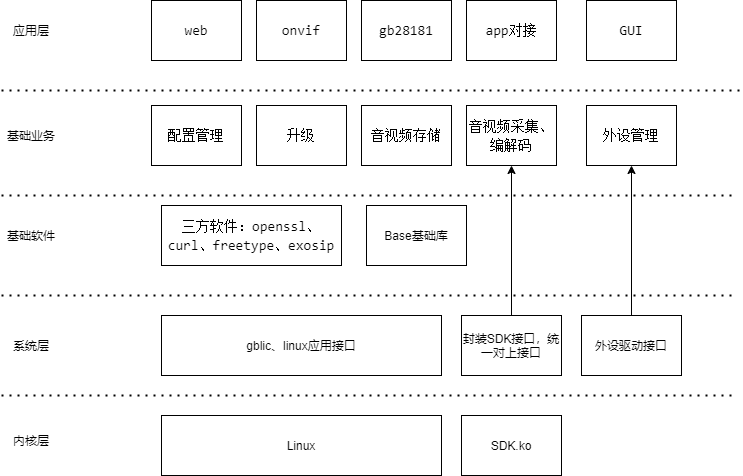

# openIPC

## 介绍
精简的IPC开源方案，目标是实现基于海思3516cv500，功能包含rtsp、onvif、mp4录像、Restful API和web网页。
##### 系统BSP
本项目不涉及uboot、linux、busybox移植，默认已经完成；可以在淘宝上买个现成的开发版，如果能够进入sh，就表明系统移植基本完成。

## 技术架构
openIPC整体遵从分层设计，从下向上依次为：内核层、系统层、基础软件层、基础业务层，应用层。
- 同时在代码实现上，参考机械装配领域的零部件的概念将系统能力抽象为组件，通过拼装和配置组件的方式定制适用于不同设备。

#### 系统层
内核应用接口，glibc接口。
驱动应用接口。
封装各厂商SDK，统一接口。

#### 基础软件层
基础软件：openssl、curl、freetype、exosip。
基础业务：配置管理、用户管理。

#### 基础业务层
业务：存储、音视频编解码、音视频播放。

#### 应用层
应用：web、onvif、gb28181、app对接。

## 编程规范
-   [C++语言编程规范](doc/编程规范/microbt-cpp-coding-style-guide.md)
-   [C语言编程规范](doc/编程规范/microbt-c-coding-style-guide.md)